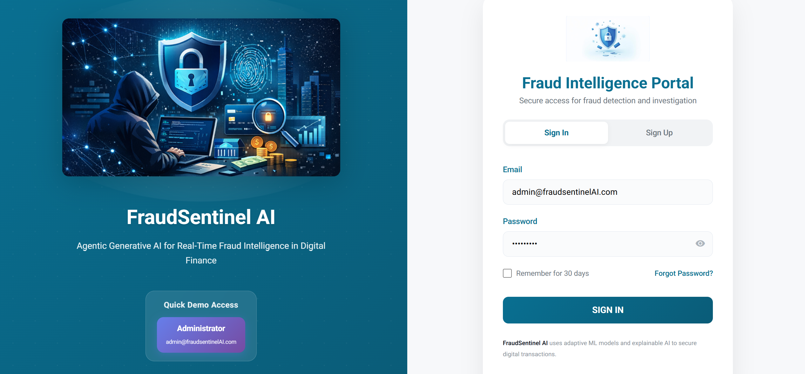
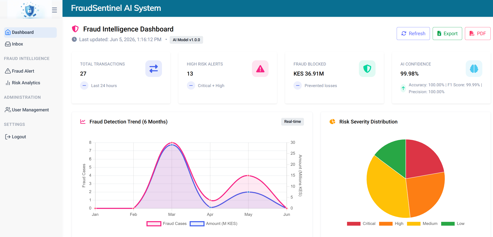
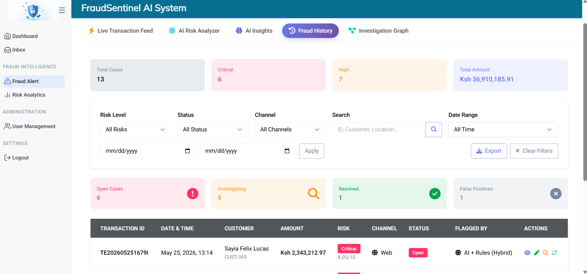
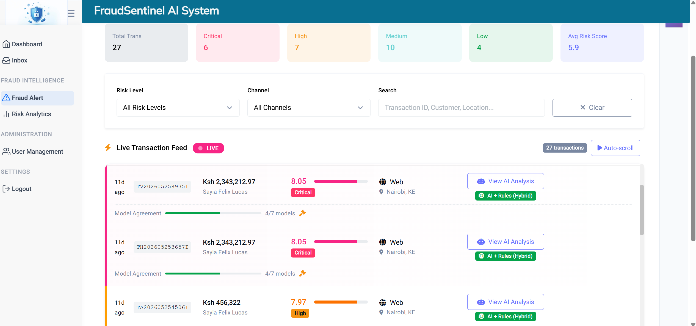
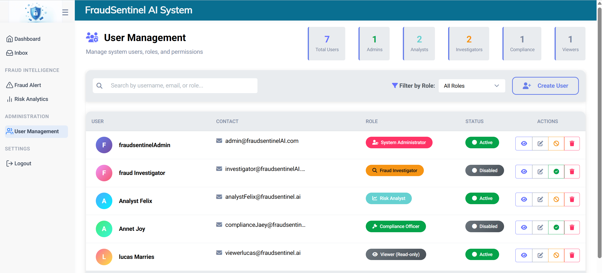

# FraudSentinel AI
### Fraud Detection Dashboard

[](https://angular.io)
[](https://www.typescriptlang.org/)
[](https://getbootstrap.com/)
[](LICENSE)

### Related Repositories

- [Frontend](https://github.com/SayiaFelix/fraudGuard.git)
- [Backend](https://github.com/SayiaFelix/finGuardAI.git)

**Note**: For full system detail, see the [Backend README](https://github.com/SayiaFelix/finGuardAI)

> **BeOrchid Africa Hackathon 2026 - Top 30 Finalist** 🏆

## Table of Contents

- [Overview](#overview)
- [Screenshots](#screenshots)
- [Demo Video](#demo-video)
- [Architecture](#architecture)
- [Features](#features)
- [How Meets Stage 3 Criteria](#how-fraudsentinel-ai-meets-stage-3-criteria)
- [Test Credentials](#test-credentials)
- [Installation](#installation)
- [Team](#team)

## Overview

FraudSentinel AI Frontend is an Angular-based dashboard for real-time fraud detection and risk monitoring. It provides financial institutions with an intuitive interface to,

- Monitor transactions in real-time
- Analyze fraud risk scores
- Investigate flagged transactions
- Manage user access and roles
- View ML model performance metrics

## Screenshots

| Login Page | Dashboard |
|------------|-----------|
|  |  |

| Risk Analyzer | Fraud History |
|---------------|----------------|
|  |  |

| Live Transactions   | User Management |
|---------------------|-----------------|
|  |  |


## Demo Video

**Watch the full walkthrough (5 minutes):** [FraudSentinel AI Demo](https://youtu.be/ i will update this once receorded )


**Click to watch the 5-minute walkthrough**

The demo covers
- Login and authentication flow
- Dashboard overview and transaction feed
- Risk analyzer with real-time scoring
- Fraud history and investigation tools
- User management and role-based access

**Deployed Live Link:** [FraudSentinel AI Portal](http://130.61.111.65:5002)

## Architecture

This frontend communicates with the FraudSentinel AI backend via REST API

For full system architecture, see the [Backend README](https://github.com/SayiaFelix/finGuardAI)

## Features

### Authentication
- **Login** - JWT token-based authentication
- **Token Interceptor** - Automatic token attachment
- **Token Refresh** - Auto-refresh on expiration
- **Role-Based Navigation** - Dynamic menu based on user role

### User Management
- **User List** - Table view with avatars and role badges
- **Search & Filter** - Search by username, email, or role
- **Pagination** - Page size selector and page navigation
- **User Details** - Side panel with full user information
- **CRUD Operations** - Create, edit, delete users
- **Role Management** - Update user roles
- **Account Management** - Enable/disable user accounts
- **Password Reset** - Generate temporary passwords 

### Dashboard & Fraud Alerts
- **Transaction Feed** - Real-time transaction monitoring
- **Risk Analyzer** - Score transactions manually
- **Fraud History** - View flagged transactions
- **Investigation Graph** - Transaction relationship mapping
- **Model Metrics** - Performance monitoring

## How FraudSentinel AI Meets Stage 3 Criteria

| Criterion | Our Implementation |
|-----------|-------------------|
| **Technical Execution (Coded MVP)** | Full Angular dashboard with 10+ components, real-time API integration |
| **Core AI Integration** | Visualizes ML risk scores, fraud history, and model metrics |
| **Simplicity & Architecture** | Modular components, JWT interceptor, role-based routing |
| **Perseverance & Progress** | Feedback form for analyst input, transaction status tracking |

## Test Credentials

After accessing the deployed link `http://130.61.111.65:5002`, use,

| Role | Email | Password |
|------|-------|----------|
| Admin | admin@fraudsentinel.com | admin@123 |
| Analyst | analyst@fraudsentinel.com | analyst@123 |

  **Quick Demo Access:** Click the button on the right side of the login form to auto-fill Admin credentials, then press **Login**.

## Prerequisites

- Node.js 16+
- npm or yarn
- Backend running at `http://localhost:5001` (see [Backend README](https://github.com/SayiaFelix/finGuardAI))


## Installation

### 1. Clone the repository
```bash
# Clone the repository
git clone https://github.com/SayiaFelix/fraudGuard.git
cd fraud_guard_dev

# Install dependencies
npm install

# Copy environment configuration
cp src/environments/environment.example.ts src/environments/environment.ts
# Edit environment.ts to point to your backend URL

# Run the development server
ng serve -o
# The app will open at http://localhost:4200
```

## Team

### FraudSentinel AI

**Team Lead**
- Felix Sayia

**Role**
- Data Scientist
- Software Engineer
- AI Solutions Architect

**Hackathon**
- Beorchid Africa Developers Hackathon 2026


